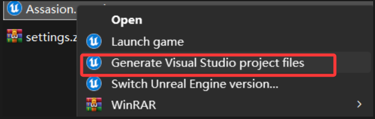

适用于**Rider + UE**环境，编译**RiderLink报内存错误**(或蓝屏)的解决方案；

<font color="red">**结论：指定 MSVC14.38 版即可；**</font>

（别用最新，微软强推最新版但是长久以来一直有bug不知道怎么想的....）

**背景：** 安装UE环境编译内存报错，严重点就是蓝屏重启；


**原因：** 没什么特别的原因，<font color="red">**UE当前稳定支持的是MSVC 14.38版本**</font>  ，而微软日常推最新的MSVC有点Bug很正常；（编译器版本BUG，且印象里持续存在）

那只装MSVC14.38行不，不行，当勾选必须环境Vs tools for ue时，就必定安装最新的MSVC（悲）；


**解决方案：**
<font color="red">

安装MSVC 14.38 + 14.44 (是最新即可，安装vs tools for ue会自动勾上的)

强制UE使用稳定支持版编译；</font>  


**操作步骤：**

1. 勾选 Visual Studio Tools for Unreal Engine 和MSVC 14.38


2. 找到UE引擎（不是项目）根目录/Engine/Saved/UnrealBuildtool下，新建BuildConfiguration.xml文件；


3. 编辑内容（<font color="green">小版本也要填好一字不错，可以用Everything搜索14.38看自己的具体版本</font> ）

```xml

<Configuration xmlns="https://www.unrealengine.com/BuildConfiguration">
    <WindowsPlatform>
        <CompilerVersion>14.38.33130</CompilerVersion>
    </WindowsPlatform>
    <BuildConfiguration>
        <bAllowUBAExecutor>false</bAllowUBAExecutor>
        <MaxParallelActions>8</MaxParallelActions>
    </BuildConfiguration>
</Configuration>

```


4. 删除UE项目缓存等目录


5. 右键生成UE工程文件




6. 使用Rider打开uproject项目，安装RiderLink即可（下图2个按钮二选一）


7. 成功编译RiderLink


